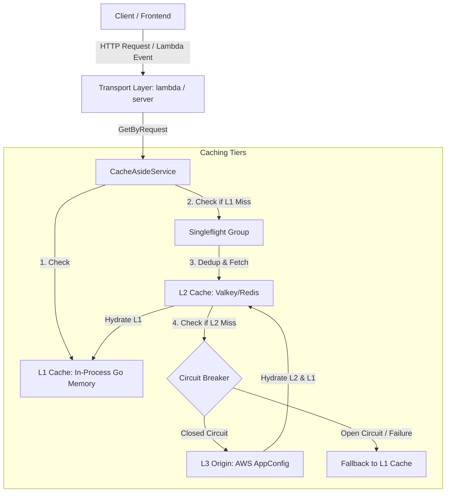
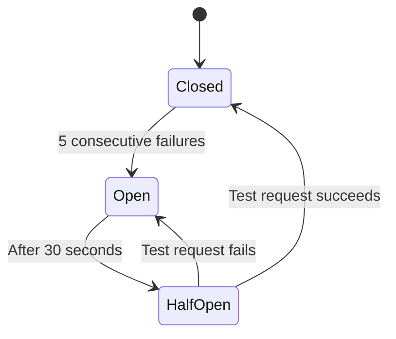

# Architecture Documentation: AppConfig Cache-Aside & Circuit Breaker

This documentation details the technical architecture, data flow, concurrency handling, and resilience strategies implemented in the `appconfig-cache` project.

---

## 1. Architectural Overview

The system is built following **Clean Architecture** principles in Go, decoupling application logic from delivery infrastructures (AWS Lambda / HTTP Server) and external data providers (AWS AppConfig, Valkey, DynamoDB).



---

## 2. 3-Tier Caching Strategy

To offload traffic from the AWS AppConfig API and curb costs, reads utilize a hierarchical cache-aside strategy:

### L1 - Local In-Memory Cache (In-Process)
- **Implementation:** Local memory within the Go execution scope.
- **Default TTL:** 60 seconds (`L1_TTL_SECONDS`).
- **Purpose:** Shared between sequential executions running in the same AWS Lambda container. Prevents short concurrent request spikes (micro-bursts) from hitting Valkey.

### L2 - Distributed Cache (Valkey / Redis)
- **Implementation:** Centralized managed Valkey (or Redis) cluster.
- **Default TTL:** Configured via `L2_TTL_SECONDS` (e.g., 5 minutes or more).
- **Purpose:** Centralized persistent shared cache. Reduces the need to query AWS even after Lambda containers are recycled.

### L3 - Origin Provider (AWS AppConfig)
- **Implementation:** API calls via the AWS SDK for Go targeting `appconfigdata`.
- **Purpose:** Primary source of configuration. Queried only in case of a full cache miss.

---

## 3. Concurrency Resolution and Singleflight

To mitigate the *cache stampede* problem (when multiple containers try to hydrate the cache at the same time after expiration), we use the **Singleflight** pattern (`golang.org/x/sync/singleflight`):

1. When an L1 cache miss occurs, the request enters the control of the `singleflight.Group` using the combination of `Application` and `Environment` as the deduplication key.
2. The singleflight group ensures that only one goroutine executes the hydration function (`resolveAndCache`).
3. Other concurrent requests for the same configuration key block and wait for this single call to return, receiving the same result synchronously. This drastically reduces concurrent traffic and avoids duplicate AWS requests.

---

## 4. Shared Circuit Breaker (DynamoDB)

To prevent slow calls or continuous failures to AWS AppConfig under unstable network conditions, a **Circuit Breaker** monitors the state of connections.

### Local vs. Shared Circuit Breaker
- **Local:** Stores state in the Lambda container's memory. Lower latency, but the state is not shared between parallel running containers.
- **Shared (DynamoDB):** Uses a DynamoDB table so that all Lambda containers instantly share the circuit state.



### DynamoDB Table Setup

Create a table with the following specification:
- **Partition Key (PK):** `application` (String)
- **Sort Key (SK):** `environment` (String)
- **TTL Attribute:** `ttl` (Number, seconds since epoch)
- **Billing Mode:** Pay-per-request or on-demand

#### AWS CLI Creation Example:
```bash
aws dynamodb create-table \
  --table-name appconfig-circuit-breaker \
  --attribute-definitions \
    AttributeName=application,AttributeType=S \
    AttributeName=environment,AttributeType=S \
  --key-schema \
    AttributeName=application,KeyType=HASH \
    AttributeName=environment,KeyType=RANGE \
  --billing-mode PAY_PER_REQUEST \
  --ttl-specification AttributeName=ttl,Enabled=true \
  --region us-east-1
```

### Technical Operation of the Circuit
- **Opening (Open):** 5 consecutive failures open the circuit.
- **Block Duration:** Requests during the open state fail fast (<1ms) with an immediate fallback to the L1 cache.
- **Transition (Half-Open):** After 30 seconds, the circuit transitions to `half-open` to test a new origin request.
- **Closing (Closed):** A success in `half-open` closes the circuit; a new failure returns it to the `open` state.

### CLI Monitoring and Diagnostics

To check the circuit state for a specific application and environment:
```bash
aws dynamodb get-item \
  --table-name appconfig-circuit-breaker \
  --key '{"application":{"S":"my_app"},"environment":{"S":"prod"}}'
```

To list all registered environment states for an application:
```bash
aws dynamodb query \
  --table-name appconfig-circuit-breaker \
  --key-condition-expression "application = :app" \
  --expression-attribute-values '{":app":{"S":"my_app"}}'
```

Example JSON response from the DynamoDB query:
```json
{
  "Item": {
    "application": { "S": "my_app" },
    "environment": { "S": "prod" },
    "state": { "S": "open" },
    "failureCount": { "N": "5" },
    "lastFailureTime": { "N": "1713700000000" },
    "ttl": { "N": "1713710000" }
  }
}
```

### Circuit Breaker Fallback Logic
If communication with DynamoDB fails or is unavailable (due to rate limits, network issues, etc.), the system **gratefully falls back to the local in-memory Circuit Breaker** in each Lambda container. This ensures high operational resilience and prevents the monitoring table from becoming a single point of failure.

### Concurrency and Performance (Non-blocking I/O)
To optimize system-wide parallelism under cache miss spikes, the local in-memory Circuit Breaker releases its mutex lock before executing the external network request to AWS AppConfig. This prevents a slow request for one configuration (e.g., `rh`) from locking the shared mutex and serializing concurrent calls to other unrelated profiles (e.g., `backoffice`). Once the external call completes, the mutex is re-acquired to safely transition states.

---

## 5. Go Project Structure (Clean Architecture)

The directory structure of the repository is organized cleanly:

- `cmd/`: Application entrypoints.
  - `cmd/lambda/`: Initialization code and AWS Lambda handler (handling API Gateway contracts).
  - `cmd/server/`: Local HTTP server (supporting `/v1/config` and `/health` routes).
  - `cmd/local/`: Fast CLI runner for manual local testing.
- `internal/domain/`: Pure Go domain models and validation rules.
  - `configuration_request.go`: Validates required fields (`application`, `environment`, `profile`).
  - `cache_key.go`: Formats the unique cache key.
  - `configuration.go`: Encapsulates the configuration document, protecting against empty states at the domain boundary.
- `internal/application/`: System use cases.
  - `ports.go`: Declares outbound port interfaces (L1/L2 cache and AWS origin).
  - `cache_aside_service.go`: Central orchestrator managing the L1 -> Singleflight -> L2 -> L3 flow.
- `internal/infrastructure/`: Outbound adapter implementations.
  - `appconfig/`: Integration with the AWS AppConfig SDK, Local Circuit Breaker, and DynamoDB Shared Circuit Breaker.
  - `cache/`: Cache adapter implementations (Go in-memory cache and Valkey/Redis).
  - `secrets/`: Integration with AWS Secrets Manager to recover Valkey credentials in production.
- `internal/bootstrap/`: Composes and injects service dependencies based on environment variables.

---

## 6. Environment Variables and Configurations

| Variable | Required | Default | Description |
| :--- | :---: | :---: | :--- |
| `AWS_REGION` | Yes | - | AWS region to access services. |
| `VALKEY_HOST` | No | - | Valkey server hostname. If omitted, attempts retrieval via Secrets Manager. |
| `VALKEY_PORT` | No | `6379` | Valkey server connection port. |
| `CACHE_SECRET_NAME` | No | - | Name of the secret in Secrets Manager containing Valkey credentials. |
| `L1_TTL_SECONDS` | Yes | `60` | Time-to-live in seconds for the in-process cache (L1). |
| `L2_TTL_SECONDS` | Yes | `300` | Time-to-live in seconds for the distributed cache (L2). |
| `X_API_KEY` | No | - | Protection API Key (accepted via header/query parameter `x-api-token`). |
| `CIRCUIT_BREAKER_TABLE_NAME` | No | - | Name of the DynamoDB table to enable the shared circuit breaker. |
