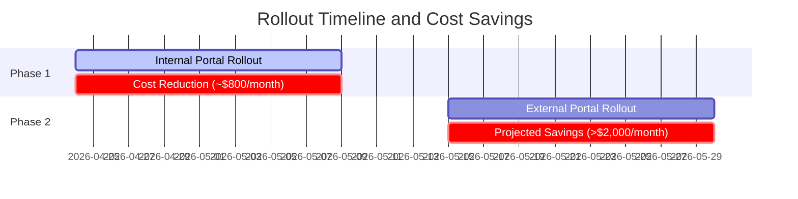

# Business Documentation: Cost Reduction and Configuration Strategy

This documentation details the business motivation, financial impact, and strategic decisions that guided the implementation of `appconfig-cache` in our core infrastructure.

## 1. The Business Problem (Cost Challenge)

Historically, consuming configurations and feature flags through **AWS Systems Manager (AppConfig)** presented an unsustainable cost trajectory for the organization, peaking near **$3,000.00 USD/month**.

### Root Cause
The legacy integration model performed continuous polling (frequent requests) directly to the AppConfig APIs from hundreds of ephemeral AWS Lambda environments (Internal Portal, External Portal, etc.). Since Lambda instances spin up and down rapidly, the number of API requests scaled strictly linearly with the platform's user traffic. Every page reload or internal request triggered paid AWS AppConfig API calls, inflating not only the Systems Manager bill but also AWS KMS decryption charges and CloudWatch log volumes.

---

## 2. The Strategic Solution (Multi-tier Caching)

To mitigate this problem without losing the flexibility of AppConfig's Feature Flags, a three-tier (**L1/L2/L3**) caching architecture was designed to decouple application traffic from AWS API consumption:

- **L1 (Local In-Memory Cache):** Maintained in the global context of the Lambda with a 1-minute TTL. Protects the infrastructure against request spikes and micro-bursts on the same instance.
- **L2 (Distributed Cache with Valkey):** A centralized cache server running Valkey. The applications query Valkey first before going to AWS.
- **L3 (AWS AppConfig Source of Truth):** Queried only in case of a cache miss or long-cycle expiration (a 7-day TTL is used for consistency fallback).
- **Singleflight (Race Condition Mitigation):** Ensures that only one concurrent request queries AWS in case of a cache miss. Parallel requests block and wait, consuming the result of the first call once hydrated in the L2 cache.

---

## 3. Financial Impact and Projections

The caching strategy was rolled out in phases to allow gradual impact measurement:

### Phase 1: Rollout on Internal Portal (April 24, 2026)
Internal Portal represents considerable traffic, but less than half of the platform's active sessions.
- **Result:** Internal Portal traffic became virtually invisible to AWS billing (read from L1/L2 cache).
- **Verified Savings:** The monthly AWS Systems Manager bill immediately dropped from **$2,317.98 USD** to **$1,547.64 USD** (a recurring saving of ~$800 USD/month).

### Phase 2: Rollout on External Portal (Backoffice - Current)
External Portal (Backoffice) accounts for **50% to 70%** of the remaining AppConfig traffic.
- **Projection:** Activating the same caching middleware in External Portal will eliminate the remaining continuous polling.
- **Target Result:** Total recurring reduction exceeding **$2,000.00 USD/month**, stabilizing the AWS Systems Manager cost **below $300.00 USD/month**.

---

## 4. Strategic Business and Infrastructure Decisions

### CloudFront Signed URLs: Secrets Manager vs. SSM Parameter Store
During the architectural design for distributing protected files (S3 via CloudFront Signed URLs), we evaluated where to store the private key used for signing:

1. **AWS Secrets Manager:**
   - *Pros:* Native automatic key rotation.
   - *Cons:* Fixed cost per secret ($0.40/month) + API request fees ($0.05 per 10,000 calls).
2. **SSM Parameter Store (SecureString):**
   - *Pros:* Free storage (Standard tier) + free API calls (up to 40 TPS).
   - *Cons:* Key rotation requires manual processes or a custom Lambda.

#### The Business Verdict
Since the CloudFront private key is static and rarely rotated, Secrets Manager's automatic rotation does not justify its cost. We chose the encrypted **SSM Parameter Store (SecureString)** using a managed AWS KMS key.
- **Cache Acceleration:** To prevent application traffic from exceeding the free tier limit of 40 TPS on Parameter Store (which would force activating the paid *Higher Throughput* mode), we implemented in-memory caching in the backend (L1) with a 5-to-10 minute TTL to hold the key in local memory. This ensures high-level security with zero storage and API traffic costs.
