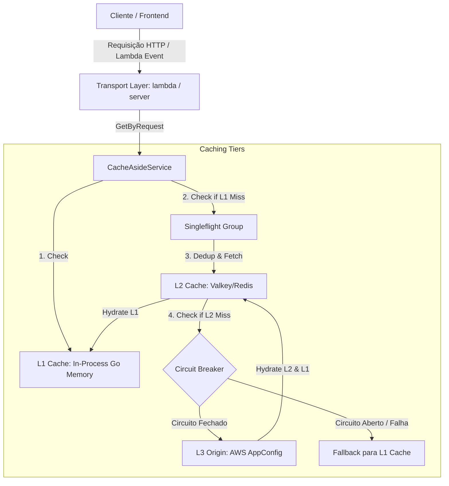
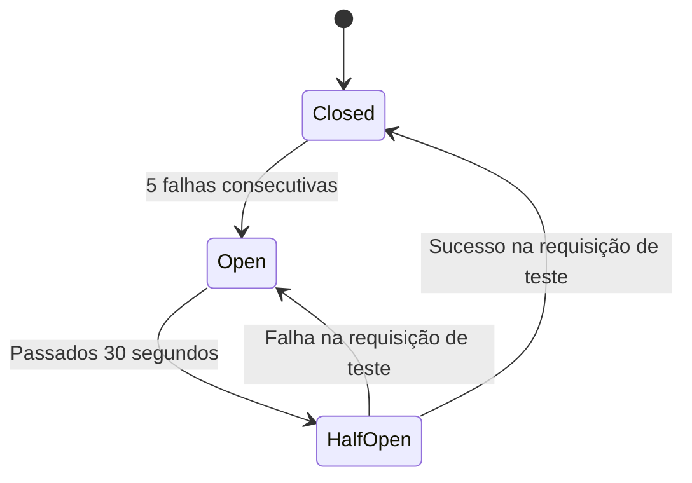

# Documentação de Arquitetura: AppConfig Cache-Aside & Circuit Breaker

Esta documentação detalha a arquitetura técnica, fluxo de dados, tratamento de concorrência e estratégias de resiliência implementadas no projeto `appconfig-cache`.

---

## 1. Visão Geral da Arquitetura

O sistema é construído seguindo os princípios de **Arquitetura Limpa (Clean Architecture)** em Go, desacoplando a lógica de aplicação das infraestruturas de entrega (AWS Lambda / Servidor HTTP) e dos provedores de dados externos (AWS AppConfig, Valkey, DynamoDB).



---

## 2. Estratégia de Caching em 3 Níveis

Para desonerar o tráfego da API do AWS AppConfig e conter os custos, as leituras utilizam uma estratégia de cache-aside hierárquica:

### L1 - Cache em Memória (In-Process)
- **Implementação:** Memória local dentro do escopo de execução do Go.
- **TTL Padrão:** 60 segundos (`L1_TTL_SECONDS`).
- **Função:** Compartilhado entre execuções sequenciais que rodam no mesmo container da AWS Lambda. Evita requisições concorrentes curtas (micro-bursts) de baterem no Valkey.

### L2 - Cache Distribuído (Valkey / Redis)
- **Implementação:** Cluster Valkey gerenciado (ou Redis).
- **TTL Padrão:** Configurado via `L2_TTL_SECONDS` (ex.: 5 minutos ou mais).
- **Função:** Cache compartilhado de persistência centralizada. Reduz a necessidade de consultar a AWS mesmo após a reciclagem de containers Lambda.

### L3 - Provedor de Origem (AWS AppConfig)
- **Implementação:** Chamadas de API via SDK Go da AWS ao `appconfigdata`.
- **Função:** Fonte primária das configurações. Consultada apenas em caso de cache miss completo.

---

## 3. Resolução de Concorrência e Singleflight

Para mitigar o problema de *cache stampede* (quando múltiplos containers tentam reidratar o cache ao mesmo tempo após expiração), utilizamos o padrão **Singleflight** (`golang.org/x/sync/singleflight`):

1. Quando ocorre um miss no cache L1, a requisição entra no controle do `singleflight.Group` usando como chave a combinação de `Application` e `Environment`.
2. O grupo de singleflight garante que apenas uma goroutine execute a função de reidratação (`resolveAndCache`).
3. Outras requisições concorrentes para a mesma chave de configuração bloqueiam e aguardam o retorno desta única chamada, recebendo o mesmo resultado de forma síncrona. Isso reduz drasticamente o tráfego concorrente e evita requisições AWS duplicadas.

---

## 4. Circuit Breaker Compartilhado (DynamoDB)

Para evitar chamadas lentas ou falhas contínuas ao AWS AppConfig sob condições de instabilidade, um **Circuit Breaker** monitora o estado das conexões.

### Circuit Breaker Local vs Compartilhado
- **Local:** Armazena o estado na memória do container da Lambda. Menor latência, mas o estado não é compartilhado entre containers em escala paralela.
- **Compartilhado (DynamoDB):** Utiliza uma tabela no DynamoDB para que todas as Lambdas conheçam instantaneamente o estado do circuito.



### Setup da Tabela DynamoDB

Crie uma tabela com a seguinte especificação:
- **Partition Key (PK):** `application` (String)
- **Sort Key (SK):** `environment` (String)
- **TTL Attribute:** `ttl` (Number, segundos desde o epoch)
- **Billing Mode:** Pay-per-request ou on-demand

#### Exemplo de criação via AWS CLI:
```bash
aws dynamodb create-table \
  --table-name appconfig-circuit-breaker \
  --attribute-definitions \
    AttributeName=application,AttributeType=S \
    AttributeName=environment,AttributeType=S \
  --key-schema \
    AttributeName=application,KeyType=HASH \
    AttributeName=environment,KeyType=RANGE \
  --billing-mode PAY_PER_REQUEST \
  --ttl-specification AttributeName=ttl,Enabled=true \
  --region us-east-1
```

### Funcionamento Técnico do Circuito
- **Abertura (Open):** 5 falhas consecutivas abrem o circuito.
- **Duração do Bloqueio:** Requisições durante o estado aberto falham rapidamente (<1ms) com fallback imediato para o cache L1.
- **Transição (Half-Open):** Decorridos 30 segundos, o circuito transita para `half-open` para testar uma nova requisição de origem.
- **Fechamento (Closed):** Sucesso em `half-open` fecha o circuito; nova falha retorna ao estado `open`.

### Monitoramento e Diagnóstico via CLI

Para verificar o estado do circuito de uma aplicação e ambiente específicos:
```bash
aws dynamodb get-item \
  --table-name appconfig-circuit-breaker \
  --key '{"application":{"S":"minha_app"},"environment":{"S":"prod"}}'
```

Para listar todos os estados dos ambientes cadastrados de uma aplicação:
```bash
aws dynamodb query \
  --table-name appconfig-circuit-breaker \
  --key-condition-expression "application = :app" \
  --expression-attribute-values '{":app":{"S":"minha_app"}}'
```

Resposta JSON de exemplo da consulta ao DynamoDB:
```json
{
  "Item": {
    "application": { "S": "minha_app" },
    "environment": { "S": "prod" },
    "state": { "S": "open" },
    "failureCount": { "N": "5" },
    "lastFailureTime": { "N": "1713700000000" },
    "ttl": { "N": "1713710000" }
  }
}
```

### Lógica de Fallback do Circuit Breaker
Se a comunicação com o DynamoDB falhar ou estiver indisponível (por limite de tráfego, rede, etc.), o sistema **faz o fallback transparente para o Circuit Breaker local** (in-memory) em cada container da Lambda, garantindo alta resiliência operacional e evitando que o monitoramento seja um ponto único de falha.

---

## 5. Estrutura do Projeto Go (Clean Architecture)

A estrutura de diretórios do repositório é organizada de forma limpa:

- `cmd/`: Pontos de entrada da aplicação.
  - `cmd/lambda/`: Código de inicialização e handler do AWS Lambda (tratando contratos de API Gateway).
  - `cmd/server/`: Servidor HTTP local (com suporte a rotas `/v1/config` e `/healthz`).
  - `cmd/local/`: CLI rápida para testes locais diretos de chamadas.
- `internal/domain/`: Regras de negócio essenciais e modelos de dados pura Go.
  - `configuration_request.go`: Valida parâmetros obrigatórios (`application`, `environment`, `profile`).
  - `cache_key.go`: Formatação da chave única de cache.
- `internal/application/`: Casos de uso do sistema.
  - `ports.go`: Interfaces do adaptador de saída (Portas de cache L1/L2 e de origem AWS).
  - `cache_aside_service.go`: Orquestrador central que decide o fluxo L1 -> Singleflight -> L2 -> L3.
- `internal/infrastructure/`: Implementação tecnológica dos adaptadores de saída.
  - `appconfig/`: Integração com o SDK AWS AppConfig, Circuit Breaker Local e Circuit Breaker Compartilhado via DynamoDB.
  - `cache/`: Implementações de adaptadores de cache (Go cache em memória e Valkey/Redis).
  - `secrets/`: Integração com AWS Secrets Manager para recuperar as credenciais de acesso ao Valkey em produção.
- `internal/bootstrap/`: Composição e injeção de dependências do serviço com base nas variáveis de ambiente.

---

## 6. Variáveis de Ambiente e Configurações

| Variável | Obrigatória | Padrão | Descrição |
| :--- | :---: | :---: | :--- |
| `AWS_REGION` | Sim | - | Região da AWS para acesso aos serviços. |
| `VALKEY_HOST` | Não | - | Endereço do servidor Valkey. Se omitido, tenta buscar via Secrets Manager. |
| `VALKEY_PORT` | Não | `6379` | Porta de conexão do Valkey. |
| `CACHE_SECRET_NAME` | Não | - | Nome do segredo no Secrets Manager contendo a chave e credenciais do Valkey. |
| `L1_TTL_SECONDS` | Sim | `60` | Tempo de vida em segundos do cache in-process (L1). |
| `L2_TTL_SECONDS` | Sim | `300` | Tempo de vida em segundos do cache distribuído (L2). |
| `X_API_KEY` | Não | - | Chave de proteção para chamadas de API (aceita via header/query `x-api-token`). |
| `CIRCUIT_BREAKER_TABLE_NAME` | Não | - | Nome da tabela DynamoDB para ativação do circuit breaker compartilhado. |
