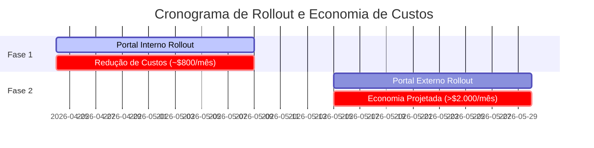

# Documentação de Negócio: Redução de Custo e Estratégia de Configuração

Esta documentação detalha a motivação de negócio, o impacto financeiro e as decisões estratégicas que orientaram a implementação do `appconfig-cache` na nossa infraestrutura.

## 1. O Problema de Negócio (Desafio de Custo)

Historicamente, o consumo de configurações e feature flags através do **AWS Systems Manager (AppConfig)** apresentava uma trajetória de custos insustentável para a organização, atingindo picos próximos a **$3.000,00 USD/mês**.

### Causa Raiz
O modelo de integração legado realizava polling contínuo (consultas frequentes) diretamente às APIs do AppConfig a partir de centenas de ambientes efêmeros de AWS Lambda (Portal Interno, Portal Externo, etc.). Como as instâncias de Lambda sobem e descem rapidamente, o número de requisições de API escalava de forma estritamente linear com o tráfego de usuários na plataforma. Cada recarregamento de página ou requisição interna gerava chamadas pagas da API do AppConfig, inflacionando não apenas a conta de Systems Manager, mas também a de decodificação no AWS KMS e volume de logs no CloudWatch.

---

## 2. A Solução Estratégica (Cache Tierizado)

Para mitigar o problema sem perder a flexibilidade das Feature Flags do AppConfig, foi projetada uma arquitetura de cache em três níveis (**L1/L2/L3**) que desacopla o tráfego da aplicação do consumo de APIs da AWS:

- **L1 (In-Memory Local):** Mantido no contexto global da Lambda com TTL de 1 minuto. Protege a infraestrutura contra picos e micro-bursts de requisições simultâneas na mesma instância.
- **L2 (Distribuído com Valkey):** Servidor centralizado de cache em memória rápida. As aplicações consultam o Valkey antes de ir para a AWS.
- **L3 (Origem no AWS AppConfig):** Acessado apenas em caso de falha de cache ou expiração de ciclo longo (TTL de 7 dias para consistência).
- **Singleflight (Mitigação de Race Condition):** Garante que apenas uma requisição por vez consulte a AWS em caso de cache expirado. As requisições concorrentes aguardam e consomem o resultado da primeira chamada hidratada no cache L2.

---

## 3. Impacto Financeiro e Projeções

A estratégia de cacheamento foi dividida em fases para mensuração gradual de impacto:

### Fase 1: Rollout no Portal Interno (24 de Abril de 2026)
O Portal Interno representa um tráfego considerável, mas menos da metade do total de sessões ativas da plataforma.
- **Resultado:** O tráfego do Portal Interno tornou-se virtualmente invisível para o faturamento da AWS (lido de cache L1/L2).
- **Economia Verificada:** A fatura mensal do AWS Systems Manager caiu imediatamente de **$2.317,98 USD** para **$1.547,64 USD** (economia recorrente de ~$800 USD/mês).

### Fase 2: Rollout no Portal Externo (Backoffice - Atual)
O Portal Externo (Backoffice) é responsável por **50% a 70%** do tráfego restante de AppConfig.
- **Projeção:** A ativação do mesmo middleware de cache no Portal Externo eliminará o restante do polling contínuo.
- **Resultado Alvo:** Redução total recorrente superior a **$2.000,00 USD/mês**, estabilizando o custo do AWS Systems Manager **abaixo de $300,00 USD/mês**.

---

## 4. Decisões Estratégicas de Negócio e Infraestrutura

### CloudFront Signed URLs: Secrets Manager vs SSM Parameter Store
Durante a evolução da arquitetura de distribuição de arquivos protegidos (S3 via Signed URLs do CloudFront), foi avaliado onde armazenar a chave privada utilizada para assinar as URLs:

1. **AWS Secrets Manager:**
   - *Prós:* Recursos nativos de rotação automática de chaves.
   - *Contras:* Custo fixo por segredo ($0.40/mês) + taxa por requisição ($0.05 a cada 10.000 chamadas).
2. **SSM Parameter Store (SecureString):**
   - *Prós:* Armazenamento gratuito (Standard) + chamadas de API gratuitas (até 40 TPS).
   - *Contras:* Rotação de chaves requer processo manual ou Lambda customizada.

#### O Veredito de Negócio
Como a chave privada do CloudFront é estática e raramente rotacionada, a rotação automatizada do Secrets Manager não justifica o custo. Optou-se pelo **SSM Parameter Store (SecureString)** criptografado com chave AWS KMS gerenciada.
- **Aceleração com Cache:** Para evitar que o tráfego da aplicação estoure o limite gratuito de 40 TPS do Parameter Store (o que forçaria a ativação do modo pago de *Higher Throughput*), foi adotado um cache em memória no backend (L1) com TTL de 5 a 10 minutos para segurar a chave em memória local. Isso garante segurança física de ponta, custo zero de armazenamento e custo zero de tráfego de API.
